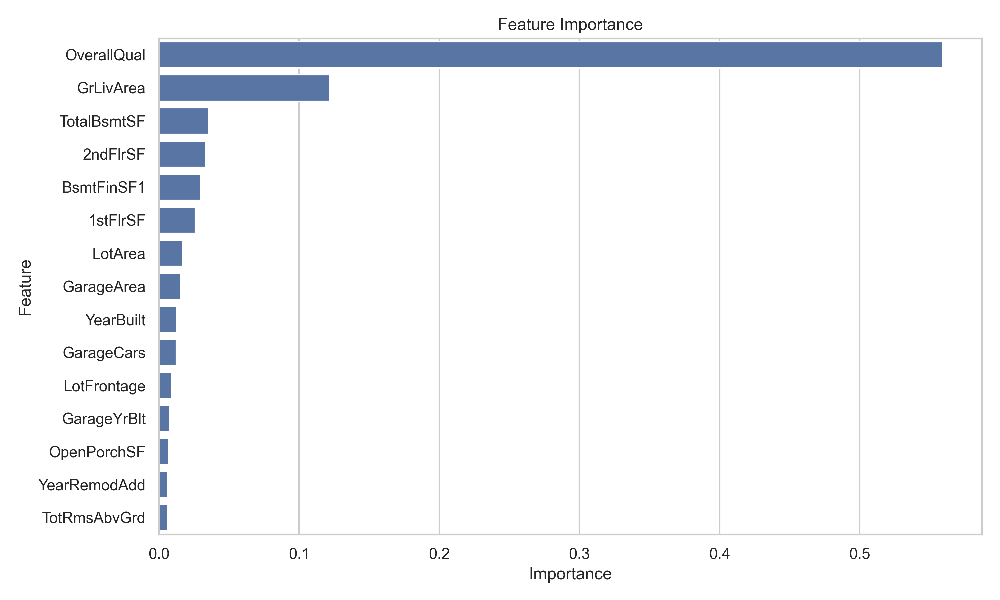
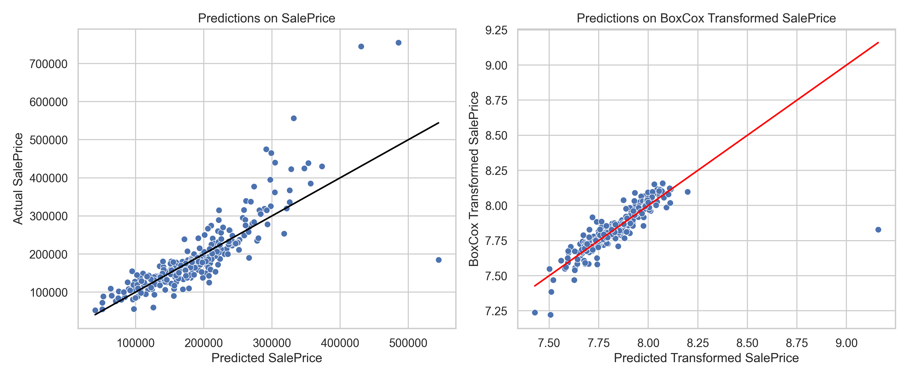
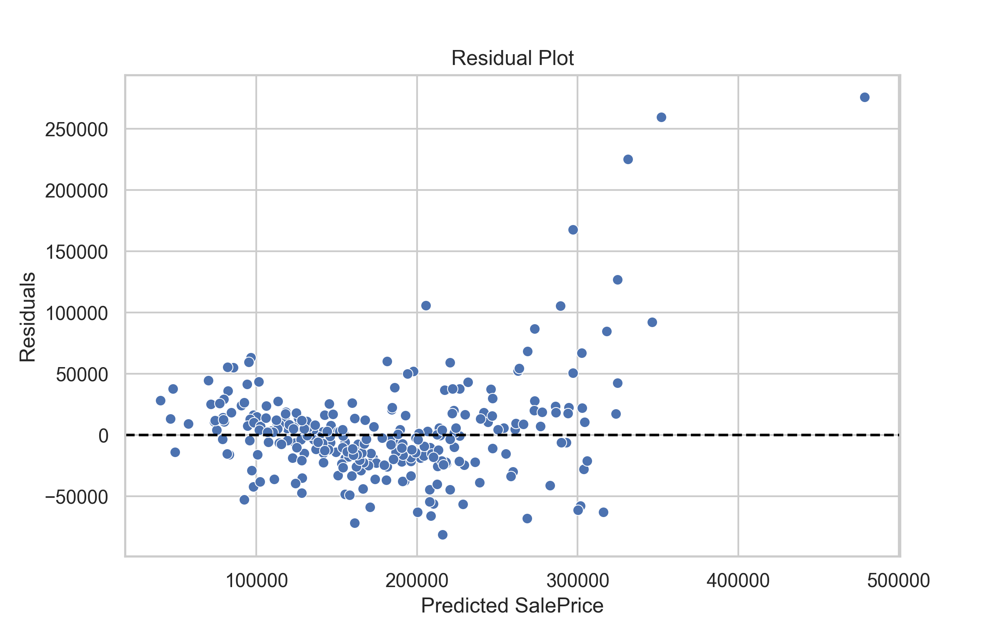

# Statistical Theory Meets Real Data

This repository contains the code and analysis for predicting house prices using the [Ames Housing Dataset](https://www.kaggle.com/c/house-prices-advanced-regression-techniques/data).

Our goal is twofold:
1. To model and predict sale prices of houses using machine learning techniques.
2. To implement and apply statistical tests to better understand the data and validate assumptions prior to modeling.

Full Report: A detailed write-up of this study is available in `report.pdf`.

## Project Highlights

- Numerical features are more significant predictors of SalePrice compared to categorical features



- Applying a Box-Cox transformation on SalePrice will improve the performance of predictive models



- Higher-priced homes tend to have lower predictive accuracy



## Setup

### Prerequisites
- Python 3.x
- NumPy
- Pandas
- statsmodels
- scikit-learn
- matplotlib
- seaborn

You can install the dependencies using:

```bash
pip install pandas numpy matplotlib seaborn scikit-learn statsmodels
```

## Running the code

You can run the analysis in Jupyter:

```bash
jupyter notebook main.ipynb
```